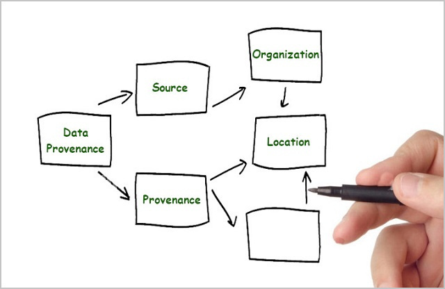
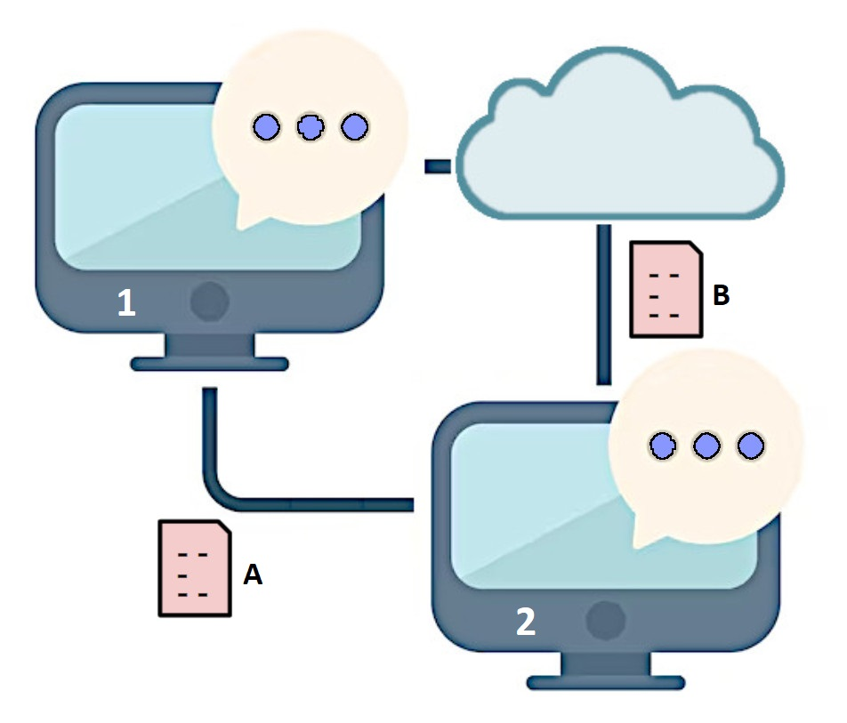
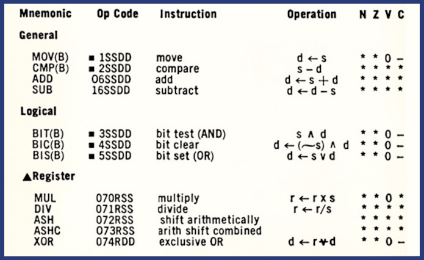

# Information Modeling for Data Interoperability

# 1 Introduction
NIST describes [[Information Modeling](#information-modeling)] as:

> An information model is a representation of concepts, relationships, constraints, rules,
> and operations to specify data semantics for a chosen domain of discourse.
> The advantage of using an information model is that it can provide sharable, stable, and
> organized structure of information requirements for the domain context.
>
> An information modeling language is a formal syntax that allows users to capture data
> semantics and constraints.

This hints at the primary reasons for using information models:

1. **High Level** - for an IM to be broadly sharable and stable, it should be a high level
specification that separates information sharing requirements from implementation details.
This makes an IM desirable for initial conceptual design where details are unknown or undecided,
for exposition and publication where they are distracting, as well as for implementation
where unambiguous specification of details using a formal syntax is essential
for robustness and interoperability.
2. **Language Independent** - an information modeling language defines information in a way that
is representation-independent both within a process and when stored or communicated among processes.
Because an IM is requirements-focused, a single specification applies to many processing environments
and data formats, ensuring that they can deliver equivalent results.



To illustrate language independence consider an environment with two different processes and
two different message formats where an information model defines the semantics and constraints
of an arbitrary data type "Foo":



* process 1 (a .NET application) writes a C# value X of type Foo to message A (XML format)
* process 2 (a Javascript application) reads message A and validates it as an instance of Foo
* process 2 writes that Javascript value to message B (JSON format)
* process 1 reads message B and validates it as a C# value Y of Type Foo

If value X = value Y, we know that processes 1 and 2 have the same information after the message
exchange, and message A is equivalent to (carries the same information as) message B.
The information model defines how to translate a message from any format to another and back without loss.
Describing how this is accomplished requires some common terminology:

1. **Class:** a blueprint or template for creating objects within a process.
It defines the characteristics (data type) and behaviors (functions or methods)
that objects of that class will possess.
2. **Object:** an instance of a class.
3. **Datatype:** a classification that specifies the set of values a variable of that type can hold and
   the comparison relationships between those values.
4. **Value:** an instance of a type in a process, specifying the valid values of an object of that type.
5. **Literal:** an instance of a type outside a process, an immutable sequence of bytes or
characters. Two different literals that are instances of the same information value are said
to be equivalent.
6. **I/O:** input/output. In the IM context I/O defines the mapping between literals and values,
parsing input and serializing output in a specified data format.

Although class and datatype appear similar, the critical distinction is that objects are dynamic while values
are static. Classes are a programming language's mechanisms for implementing variables while types define
the set of constant values a variable of a specified type may have, as defined in [[XSD](#xsd)]:

> In this specification, a datatype has three properties:
> * **value space**, which is a set of values.
> * **lexical space**, which is a set of **literals** used to denote the values.
> * a small collection of functions, relations, and procedures associated with the datatype.
> Included are equality and (for some datatypes) order relations on the **value space**,
> and a **lexical mapping**, which is a mapping from the **lexical space** into the **value space**.

To illustrate the relationship between objects, values and literals, consider a simple example:
the information in a geographic coordinate:

> Geographic Coordinate: A set of two angular measurements - a latitude with a value between
> -90.0 and 90.0 degrees and a longitude with a value between -180.0 and 180.0 degrees.

The meaning of Coordinate is the same across all processing environments with no dependence on
programming language or coding techniques. A designer uses an information modeling language to
express coordinate semantics by defining a type:
```
Coordinate = Record
    1 latitude     Number [-90.0, 90.0]
    2 longitude    Number (-180.0, 180.0]
```
where **Record** and **Number** are datatypes built into an IM language. Record is a collection of values
and Number is an atomic value, each with semantics defined by the modeling language and the designer's model.
The Coordinate type specifies what values a variable of type Coordinate may have (its value space),
but not its operations, such as computing the distance between two points.

A single **value** of type Coordinate (for example 38.8895, -77.0352) is processed using an **object**
containing two floating point variables, but details of the object aside from its value and
equality with other values of the same type is immaterial.
The **lexical-to-value mapping** used for message I/O is the key to interoperability.
A single Coordinate value can be serialized using at least three different dialects of XML,
four dialects of JSON / YAML, raw binary, CBOR, and other data formats, as well as with literals
using degrees-minutes-seconds format instead of decimal degrees in all formats.
All of these messages carry the identical value and are equivalent, but information modeling
is useful for its simple format-agnostic definitions even if only a single data format is used.

```
XML:
   1. <Coordinate latitude="38.8895" longitude="-77.0352"></Coordinate>
    
   2. <Coordinate>
        <Latitude>38.8895</Latitude>
        <Longitude>-77.0352</Longitude>
      </Coordinate
    
   3. <Coordinate>38.8895, -77.0352</Coordinate>

JSON:
   1. {"latitude": 38.8895, "longitude": -77.0352}
   
   2. {1: 38.8895, 2: -77.0352}
    
   3. [38.8895, -77.0352]
    
   4. "38.8895, -77.0352"

YAML:
   1. ---
      latitude: 38.8895
      longitude: -77.0352
  
   2. ---
      1: 38.8895
      2: -77.0352  
     
   3. ---
      - 38.8895
      - -77.0352
       
   4. 38.8895, -77.0352

Binary - 8 bytes, two IEEE 754 floats:
   1. 421B8ED9 C29A1206

Concise Binary Object Representation (CBOR) - 11 bytes, two floats:
   1. 82                # array(2)
         FA 421B8ED9    # primitive(1109102297)
         FA C29A1206    # primitive(3264877062)
```

Because there are many ways to serialize the identical information, an information modeling language
extends XSD's concept of Type (value space, lexical space, L2V mapping) to multiple serializations.
An IM Type defines a single value space, multiple lexical spaces, and for each lexical space an L2V mapping.
Within a process, for each Type in an IM there is an object (executable code) that validates information
values, and for each supported data format an object that performs L2V mapping (parsing and serialization).
An information modeling language should define the minimal set of types necessary to support a broad
range of information exchange requirements.

The OASIS JSON Abstract Data Notation ([[JADN](#jadn)]) language defines the following types:

* Primitive Types:
  * Boolean
  * Integer
  * Number
  * String
  * Binary
* Compound Types:
  * Array
  * ArrayOf
  * Map
  * MapOf
  * Record
* Union Types:
  * Enumerated
  * Choice

As shown in the Coordinate examples, the Record type defines both an Array and a Map form
of the values it contains, establishing the semantic equivalence between forms.
JADN also defines equivalent numeric and string forms of enumerated values including Map keys,
supporting strings for human readability and numeric index for concise machine-optimized messages.
Consult the JADN specification for details on the available types, mapping between syntax and
semantics, and additional capabilities such as type inheritance.

<!----

**Parking lot:**

Javascript [[ES](#es)]
4.3.1 "Even though ECMAScript includes syntax for class definitions, ECMAScript objects are not
fundamentally class-based such as those in C++, Smalltalk, or Java."

6.1.1 Undefined Type  
6.1.2 Null Type  
6.1.3 Boolean Type  
6.1.4 String Type  
6.1.5 Symbol Type  
6.1.6.1 Number Type  
6.1.6.2 BigInt Type  
6.1.7 Object Type - key can be only string or symbol - symbol denotes object functions (e.g. asyncIterator)  
20.1 Object Objects  
20.2 Function Objects  
20.3 Boolean Objects  
20.4 Symbol Objects  
20.5 Error Objects  
21.1 Number Objects  
21.2 BigInt Objects  
21.3 Math Objects  
21.4 Date Objects  
22.1 String Objects  
22.2 RexExp Objects  
23.1 Array Objects  
23.2 TypedArray Objects  
24.1 Map Objects - "both the keys and values may be arbitrary ES language values" including "object" but not Array or ArraryBuffer (binary)  
24.2 Set Objects  
24.3 WeakMap Objects  
24.4 WeakSet Objects  
25.1 ArrayBuffer Objects - (Binary values)  

"Object" does not mean Object-Oriented Programming:
The DEC PDP-11 1970's-era minicomputer has memory, registers, operations, and I/O.
Even its 8- and 16-bit values operated on by machine-level instructions are objects with values and operations:



"YAML Schemas" [[YAMLS](#yamls)]
describes advantages of using the YAML data format and the challenges of validating YAML data
in various programming languages.


###### [ES]
*"ECMAScript 2026 Language Specification"*, ECMA International, 15 July 2025,
https://tc39.es/ecma262/#sec-set-objects

###### [YAMLS]
*"YAML Schemas"*, Codethink, November 2021, https://www.codethink.co.uk/articles/2021/yaml-schemas/

-->

---------

## References

###### [IM]
*"Information Modeling: From Design to Implementation"*, Y. Tina Lee, NIST, September 1999,
https://tsapps.nist.gov/publication/get_pdf.cfm?pub_id=821265

###### [JADN]
*"JSON Abstract Data Notation (JADN) Version 2.0, CS Draft 01"*, OASIS Open, 19 February 2025,
https://docs.oasis-open.org/openc2/jadn/v2.0/jadn-v2.0.html

###### [XSD]
*"W3C XML Schema Definition Language (XSD) 1.1 Part 2: Datatypes"*, W3C, 5 April 2012,
https://www.w3.org/TR/xmlschema11-2/#datatype

